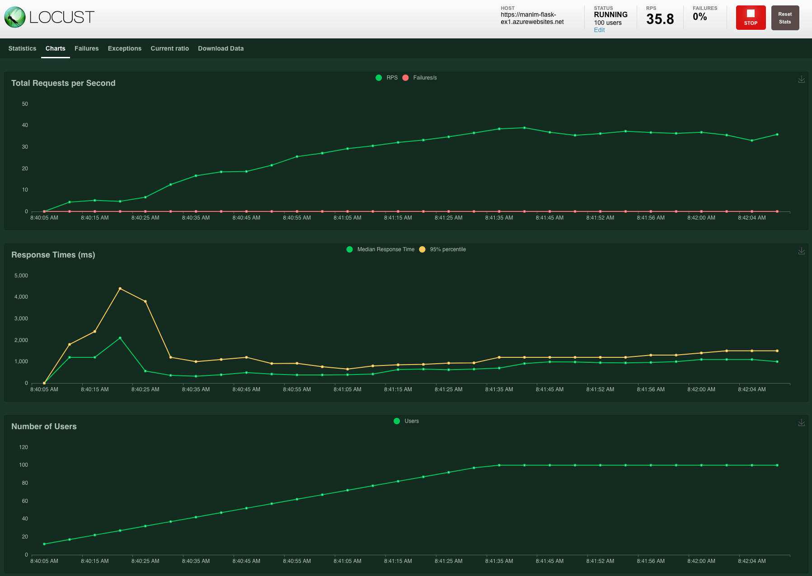

# Overview

This project demonstrate how to do CI/CD with GitHub Actions and Azure Devops pipeline. We will test, build and deploy
to Azure App Service an ML Python Flask application that predict housing price in Boston using GitHub Action and Azure
Devops pipeline.

## Project Plan

<TODO: Project Plan

* A link to a Trello board for the project
* A link to a spreadsheet that includes the original and final project plan>

## Dependencies

1. Create an [Azure Account](https://portal.azure.com)
2. Create an [GiHub Account](https://github.com/)

## Instructions

### Architectural Diagram

### Setup Azure Cloud Shell

1. Login to the [Azure Portal](https://portal.azure.com) and open the cloud shell
   
2. Generate SSH key by running `ssh-keygen -t rsa` command.
3. After the SHH key has been generated, run `cat ./.ssh/id_rsa.pub` and copy the value
4. Navigate to [SSH and GPG key](https://github.com/settings/keys) to add the SSH key to your GitHub account
   

### Clone the GitHub Repository from Cloud Shell

1. After setup the SSH key, go back to cloud shell and run `git clone git@github.com:manlm/udacity-ci-cd-project.git`
   command to clone the repository
   

### Run Makefie

1. Run `python3 -m venv ~/.myrepo` command to setup the Python virtual environment
2. Run `source ~/.myrepo/bin/activate` command to activate the Python virtual environment
3. Run `make all` command, this will install project requirements from the requirements.txt file, run pytest and pylint
   

### Test run using GitHub action

1. Output of the test run using GitHub action:
   

### Azure Devops pipeline

1. [Create an Azure DevOps project and connect to Azure](https://docs.microsoft.com/en-us/azure/devops/pipelines/ecosystems/python-webapp?view=azure-devops#create-an-azure-devops-project-and-connect-to-azure)
2. [Use CI/CD to deploy a Python web app to Azure App Service on Linux](https://docs.microsoft.com/en-us/azure/devops/pipelines/ecosystems/python-webapp?view=azure-devops#create-a-python-specific-pipeline-to-deploy-to-app-service)
3. [Run the pipeline](https://docs.microsoft.com/en-us/azure/devops/pipelines/ecosystems/python-webapp?view=azure-devops#run-the-pipeline)
4. Output from the pipeline execution
   
5. On the Azure portal we can see the Deployment history of the App Service
   
6. We call also see the streamed log of the application
   
7. Run the `make_predict_azure_app.sh` file to test the predict api of the application
   

### Locust load test

## Enhancements
In the future, I would add the health check load test step to the pipeline to make sure the application is deployed and run properly. I think the health check is a must-do after every deployment. And the load test could help us see if the performance is affected by the new code we add.

## Demo

<TODO: Add link Screencast on YouTube>

